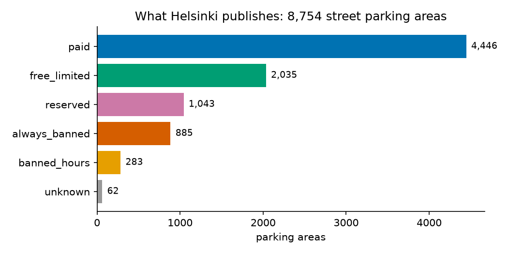
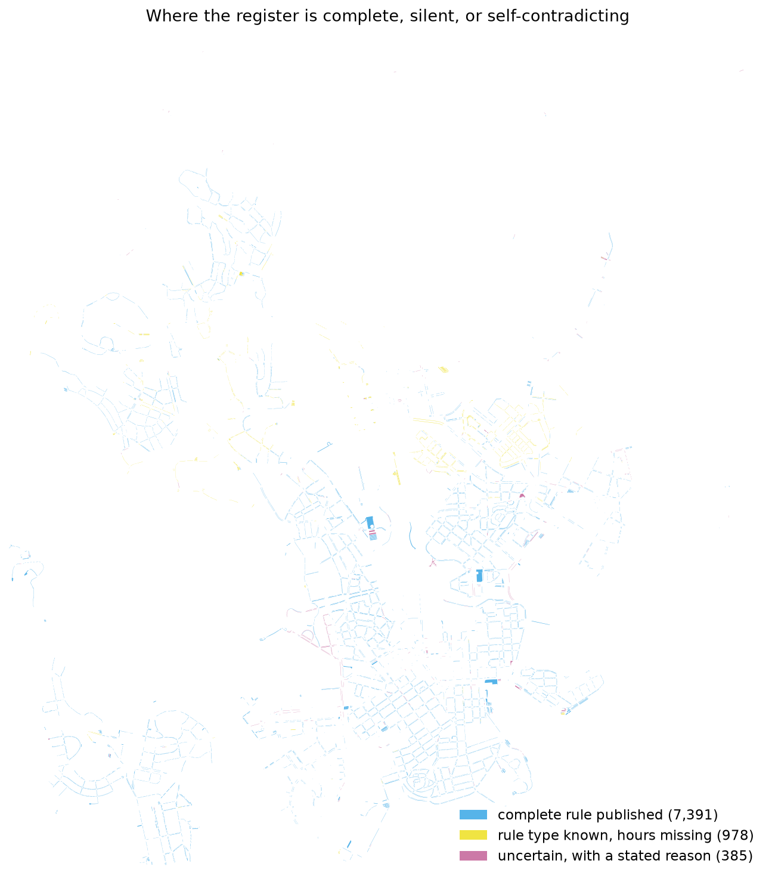
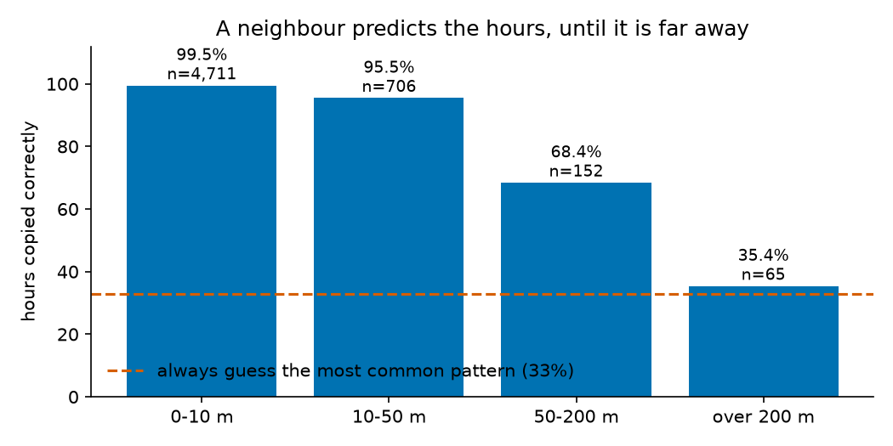

# How this project was built

Parkkiko is a University of Helsinki *Introduction to Data Science* mini-project. This page walks
through the six stages of a data science project and points at the code, data and results behind
each one, so anything claimed here can be checked.

The charts below, and the tables in [report_stats.md](report_stats.md) they summarise, are
generated by [`analysis/report_stats.py`](../analysis/report_stats.py) from the committed
snapshot. Rerun it with `--write --figures` and they regenerate. Numbers quoted in prose are
copied from that output; the fines count and the rejected-dataset measurements are one-off and
sourced where they appear.

---

## 1. Purpose

Helsinki publishes every street parking rule as open data, in a form no driver can use. On the
street the rule is invisible: it depends on the day, the hour and the side of the road, and the
sign that states it may be behind you. The city recorded 156,383 parking fines and 9,341 warnings
in 2023.

**Target audience:** drivers in central Helsinki without a residential parking permit, especially
visitors and occasional drivers.

**The promise, and its limit.** The app never claims to grant permission. It shows the city's rule,
says where that rule came from, and says plainly when it does not know. A wrong "you may park here"
costs a fine; an honest "unsure" costs nothing.

Written up as a canvas in [mini-project-canvas.md](mini-project-canvas.md).

---

## 2. Data collection

The City of Helsinki parking register, 8,754 street parking areas, served over WFS under
CC BY 4.0 with no key or registration, plus the city's district boundaries. Sources and sizes
are listed in [data.md](data.md). [`pipeline/fetch.py`](../pipeline/fetch.py) saves a dated
snapshot of exactly what the server returned, so results are reproducible.

Sources, sizes, timings and limits: [data.md](data.md).

**A dataset we evaluated and rejected.** The city also publishes "temporary traffic arrangements",
which sounded like live roadworks. Measured, they run a median of 711 days, and of the 191 parking
areas overlapping one, only 18 state a purpose mentioning parking. An overlap told us a permit
exists nearby, not that the spaces are gone, so we dropped it. The measurement and the reasoning
are in [future-work.md](future-work.md).

---

## 3. Preprocessing

[`pipeline/rules.py`](../pipeline/rules.py) parses the register's human text;
[`pipeline/process.py`](../pipeline/process.py) applies it and writes the outputs.

| Raw | Parsed |
|---|---|
| `9-21, (9-18)` | Mon–Fri 9–21, Sat 9–18 |
| `4 h`, `4h`, `4 H`, `4` | 240 minutes |
| `ei aikarajaa` | no limit |
| class 0 plus space type `Taxi` | reserved, taxi |

**The parsers fail closed.** Each must account for every character of a field. An earlier version
answered confidently from the part it recognised: `7-18 7-15` became `7-18`, and
`max 60 min lauantai` became 60 minutes with the Saturday condition silently dropped. Both are now
flagged instead. Every area carries a status, a machine-readable issue code, and a reason in plain
words.

The pipeline also refuses to write unless ids are unique and present, every area has a geometry
it can measure, every shape is a polygon, and the coordinates are metres around Helsinki. That
last one matters because reading the file asserts the coordinate system rather than verifying it.

---

## 4. Exploration

Notebooks: [01 what the register contains](../notebooks/01_parking_rules.ipynb),
[02 can neighbours predict missing hours](../notebooks/02_missing_hours_neighbours.ipynb),
[03 English labels and lookup tables](../notebooks/03_cleaning_preparation.ipynb).
Generated tables: [report_stats.md](report_stats.md).

### What the city publishes



Three quarters of street parking allows parking in some form. The remaining quarter, reserved and
banned, is where fines happen and is exactly what a driver cannot see from the car. Reserved areas
are mostly e-scooter, electric car, taxi and loading spaces: they look ordinary, and they are not.

### What the app can answer



| Status | Areas |
|---|---|
| Complete rule published | 7,391 |
| Rule type known, hours missing | 978 |
| Uncertain, with a stated reason | 385 |

The gaps are not spread evenly. They cluster outside the centre, which matters for who the
prediction below can help.

### The finding that chose the method



Hiding each area's hours and copying from its nearest same-class neighbour is correct 97.5% of the
time, against 32.9% for always guessing the most common pattern. Accuracy depends almost entirely
on distance, and the areas we actually need to predict sit a median of 153 m from the nearest area
we can learn from, with only 17.7% within 50 m. So the headline number describes areas we do not
need to predict, and the honest expectation is a confident answer for some of the 978 and
"unknown" for the rest.

This is the stage deciding the method rather than the method deciding the stage.

---

## 5. Learning

*In progress.* Supervised classification: predict the hours pattern of an area from its
neighbours, the distance to them, the class and the district. Planned and partly measured:

- a dummy baseline to beat, currently 32.9%
- accuracy and macro-F1, since some hour patterns are rare
- spatially blocked cross-validation, because neighbouring sections of one street are
  near-duplicates and a random split would test on copies of the training data
- a distance cut-off chosen from the accuracy-versus-coverage trade-off, favouring accuracy
- error analysis on a map, and a reflection on what imputation changes for a driver

---

## 6. Communication

A mobile-friendly map in [`web/`](../web): Vite, React and Leaflet, no backend, with the rules
precomputed into a single file of about 0.4 MB compressed. Colours are Okabe-Ito, colour-blind
safe, and every colour is paired with a text label.

For anyone who prefers SQL to Python, [querying.md](querying.md) shows how to query the processed
data with DuckDB, no server and no account.

---

## Reproducing all of it

```bash
python3 -m venv .venv && .venv/bin/pip install -r requirements.txt
.venv/bin/python pipeline/fetch.py                        # dated raw snapshot
.venv/bin/python pipeline/process.py                      # parsed rules + app data
.venv/bin/python analysis/report_stats.py --write --figures   # every table and chart here
```

## What we would do differently

- **A coordinate system bug we caused ourselves.** A GeoJSON file always declares itself as WGS84
  even when it holds metric coordinates, so our metric file was read as degrees. Nothing crashed.
  A spatial join simply matched zero rows, and we only noticed because zero was implausible.
- **Check a dataset before trusting its name.** "Temporary traffic arrangements" last years.
- **Fail closed from the first version.** Our first parsers silently truncated what they did not
  understand, which in an app about honesty is the worst failure mode available.
